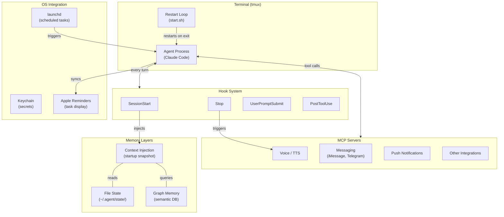

# Architecture Overview

High-level view of a persistent local agent system.

## How It Fits Together

The agent process runs inside a tmux session with a restart loop — if it exits or crashes, it comes back automatically. On every session start, hooks gather context from file state and graph memory, injecting a compressed snapshot into the agent's context window. During conversation, the agent uses MCP servers for capabilities beyond text (voice, messaging, notifications). The OS layer provides scheduling, secrets management, and integration with native apps.

The key insight: the agent is not just a chat interface. It's a system with persistent state, scheduled behaviors, and external integrations — all coordinated through hooks and file-based state.
