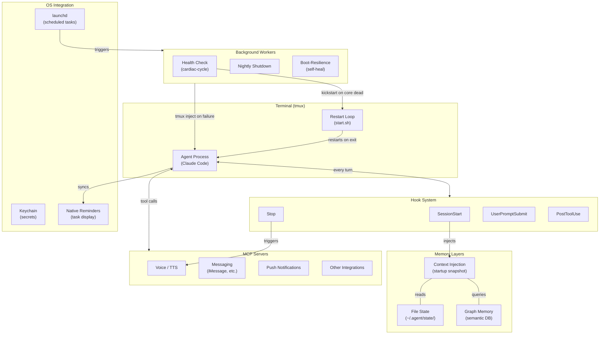

# Architecture Overview

High-level view of a persistent local agent system.

## How It Fits Together

The agent process runs inside a tmux session with a restart loop (claude-loop.sh) — if it exits or crashes, the loop catches it, runs a session summarizer, and starts a fresh session. The loop includes a circuit breaker: if sessions are dying within 30 seconds repeatedly, it backs off exponentially and pages the operator rather than spinning forever.

On every session start, the startup hook gathers all context from file state and graph memory and injects it as `additionalContext` — no tool calls needed to orient the agent. The agent begins with everything it needs already in its context window.

Background workers (launchd) handle health monitoring, nightly scheduled restarts, and boot-resilience: the health check runs every 30 minutes completely outside the agent, detecting dead sessions and kickstarting the auto-launch service to recover. Only when something is wrong does it involve the agent (by injecting an alert into the tmux session).

The key insight: the agent is not just a chat interface. It is a system with persistent state, scheduled behaviors, and external integrations — all coordinated through hooks, file-based state, and OS-level service management.
