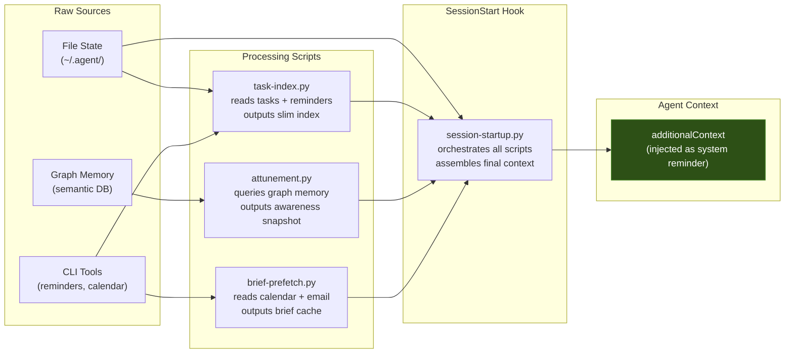

# Context Flow

How information moves from raw state into the agent's context window.

## Design Principles

**Scripts do the heavy lifting, not the agent.** Each processing script is a standalone Python file that reads raw data, filters, compresses, and outputs a text summary. The agent never sees raw JSON, full database dumps, or unfiltered file contents at startup.

**The hook is the orchestrator.** `session-startup.py` calls each script, collects their outputs, and assembles them into a single `additionalContext` string. This keeps the logic modular — you can add or remove data sources by editing one file.

**Output is always text, always slim.** A task index is 5-10 lines. An attunement snapshot is 15-20 lines. A brief flag is one line. The total injection is typically under 100 lines — a tiny fraction of the context window, but enough for the agent to be immediately oriented.

**Parallel where possible, sequential where necessary.** Scripts that don't depend on each other can run concurrently. Background tasks (backfills, prefetches) are spawned as subprocesses and don't block startup.
