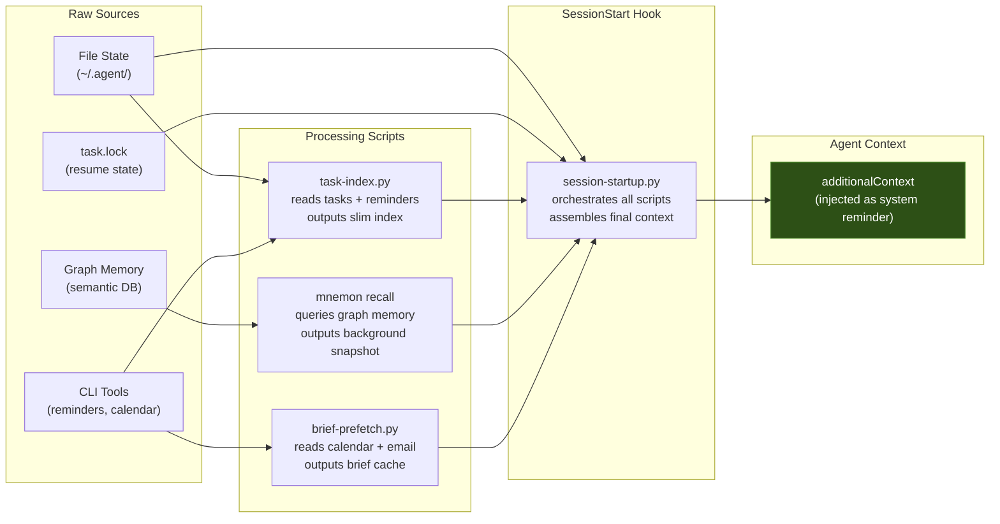
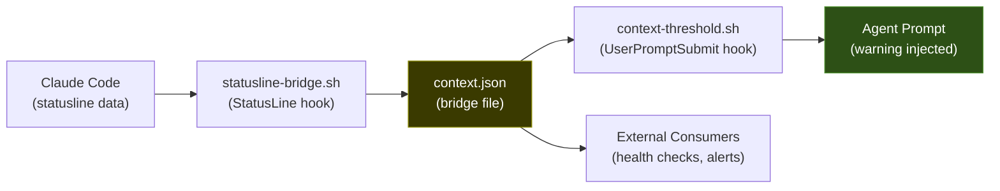

# Context Flow

How information moves from raw state into the agent's context window.

## Context Health Pipeline

A second flow runs on every turn, not just at session start:

The bridge file is written by the statusline hook and read by the threshold hook -- and by anything else (health checks, dashboards, alert scripts) that needs to know context state without querying the agent directly.

## Design Principles

**Scripts do the heavy lifting, not the agent.** Each processing script is a standalone Python file that reads raw data, filters, compresses, and outputs a text summary. The agent never sees raw JSON, full database dumps, or unfiltered file contents at startup.

**The hook is the orchestrator.** `session-startup.py` calls each script, collects their outputs, and assembles them into a single `additionalContext` string. This keeps the logic modular — you can add or remove data sources by editing one file.

**task.lock is resume state, not context.** If the agent restarts mid-task, the startup hook reads the lock and injects a resume directive. The agent picks up from the recorded STEP immediately. The lock is updated at wrap-up time, not at startup.

**Output is always text, always slim.** A task index is 5-10 lines. A graph memory recall is 3-5 key insights. A brief flag is one line. The total injection is typically under 100 lines — a tiny fraction of the context window, but enough for the agent to be immediately oriented.

**Parallel where possible, sequential where necessary.** Scripts that don't depend on each other can run concurrently. Background tasks (backfills, prefetches) are spawned as subprocesses and don't block startup.

**Thresholds are percentage-based, not absolute.** The context health pipeline uses `used_pct` from the bridge file, not raw token counts. This makes the system model-agnostic -- a threshold of 30% means the same thing whether the window is 200K or 1M tokens.
