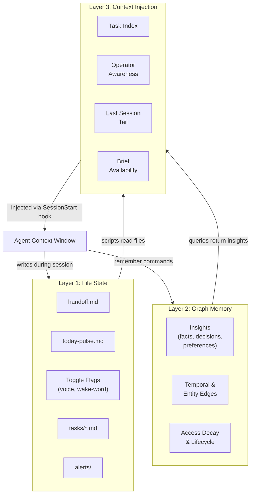

# Memory Layers

How persistent memory is structured across three tiers.

## The Three Tiers

**Layer 1 — File State** is the fastest and most deterministic. Toggle flags, handoff files, pulse entries, task files — all plain text, instantly readable, no queries needed. This is your agent's short-term working memory.

**Layer 2 — Graph Memory** is the semantic layer. A database of insights with importance scores, entity linking, temporal edges, and access-based decay. You query it with natural language and get relevance-ranked results. This is long-term memory.

**Layer 3 — Context Injection** is the bridge. At startup, scripts read from Layers 1 and 2, compress the results into a slim snapshot, and inject it into the agent's context window via the SessionStart hook. The agent never touches the raw data stores directly during startup — it receives a curated summary.

The flow is always: **store broadly, inject narrowly**. Memory accumulates freely across sessions, but what enters the context window is filtered and compressed.
