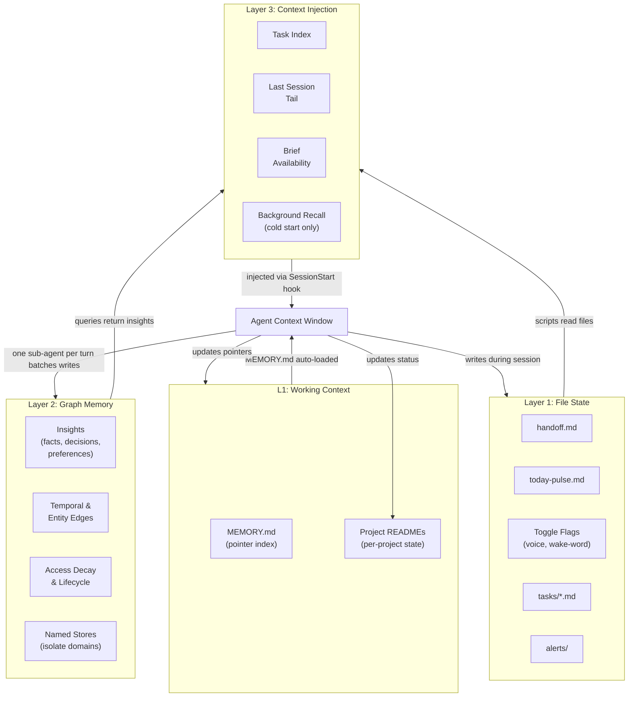

# Memory Layers

How persistent memory is structured across tiers.

## The Tiers

**Layer 1 -- File State** is the fastest and most deterministic. Toggle flags, handoff files, pulse entries, task files -- all plain text, instantly readable, no queries needed. Hooks and daemons use this layer directly.

**L1 -- Working Context (MEMORY.md + project READMEs)** is the always-visible scratchpad. MEMORY.md is a pointer index: one line per active project, open questions, session notes. Project READMEs are the per-project source of truth (situation, status, phases, key files). MEMORY.md points to them; it does not duplicate their content. Both are read on demand, not pre-loaded for all projects at startup.

**Layer 2 -- Graph Memory** is the semantic layer. A database of insights with importance scores, entity linking, temporal edges, access-based decay, and (optionally) multiple named stores for domain isolation. You query it with natural language and get relevance-ranked results. Writes are batched through a single sub-agent per turn -- never written inline in the main conversation thread.

**Layer 3 -- Context Injection** is the bridge. At startup, scripts read from Layers 1 and 2, compress the results into a slim snapshot, and inject it into the agent's context window via the SessionStart hook. The agent never touches the raw data stores directly during startup -- it receives a curated summary.

The flow is always: **store broadly, inject narrowly**. Memory accumulates freely across sessions, but what enters the context window is filtered and compressed.

## Recall Routing

For in-conversation recall (recall-before-responding), route through your primary recall path rather than calling the graph memory CLI directly. If your graph memory supports PPR (Personalized PageRank) augmentation, that path improves multi-hop recall for free-form conversational queries. For short structured queries (startup recall, category-filtered lookups), use the direct CLI -- PPR tuning optimized for free-form conversation can hurt precision on targeted lookups. Keep the paths separate.
