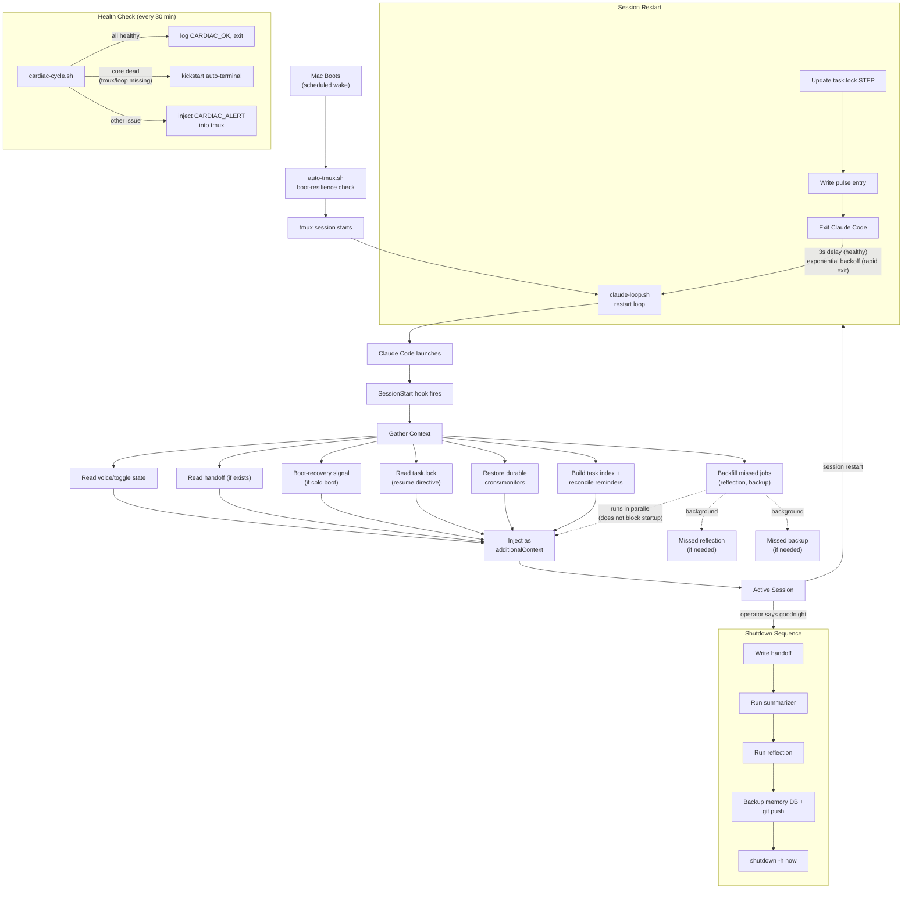

# Session Lifecycle

The full flow from boot to shutdown.

## Key Points

**Startup is zero-cost to the agent.** All context gathering happens in the hook before the agent sees its first prompt. No tool calls needed — everything arrives as injected context. Headless background workers (no tmux) get a 2-line stamp instead of the full payload; they don't need orientation.

**Task lock carries thread across restarts.** If a task was in progress when the session ended, `task.lock` holds the next concrete step. The startup hook injects it as a resume directive — the agent picks up work immediately without needing a handoff.

**Durable background tasks are re-created automatically.** Crons and monitors registered as durable in a JSON registry are restored by the startup hook on every new session. Session-scoped entries are purged.

**Shutdown is sequential and ordered.** Handoff first (preserves task thread), then summarizer (captures session knowledge), then reflection (daily self-assessment), then backups, then power off. Each step must complete before the next begins.

**The restart loop has a circuit breaker.** If sessions die within 30 seconds repeatedly, the loop backs off exponentially (3s, 6s, 12s, ... capped at 5 minutes) and pages the operator after 10 consecutive rapid exits rather than spinning indefinitely.

**Boot-resilience is layered.** `auto-tmux.sh` verifies the tmux session survived the first 5 seconds after creation (it can vanish on flaky boot) and rebuilds once; `cardiac-cycle.sh` runs every 30 minutes as the ongoing backstop, kickstarting the auto-launch service if the session has gone dark.

**Backfills run in parallel with context injection.** If the machine was powered off when a daily job was supposed to run, the startup hook detects the gap and runs missed jobs as background processes. They do not block context injection or session startup — the agent begins immediately while backfills complete independently.
