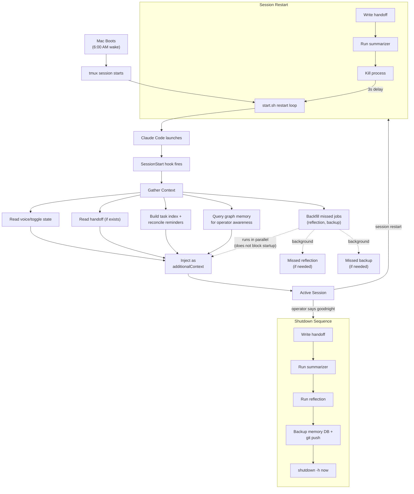

# Session Lifecycle

The full flow from boot to shutdown.

## Key Points

**Startup is zero-cost to the agent.** All context gathering happens in the hook before the agent sees its first prompt. No tool calls needed — everything arrives as injected context.

**Shutdown is sequential and ordered.** Handoff first (preserves task thread), then summarizer (captures session knowledge), then reflection (daily self-assessment), then backups, then power off. Each step must complete before the next begins.

**The restart loop is the safety net.** If the agent crashes, exits, or is killed, the loop in start.sh waits 3 seconds and launches a fresh session. The summarizer runs on every exit (including crashes) to preserve knowledge.

**Backfills run in parallel with context injection.** If the machine was powered off when a daily job was supposed to run, the startup hook detects the gap and runs missed jobs (reflection, backup) as background processes. They do not block context injection or session startup -- the agent begins immediately while backfills complete independently.
